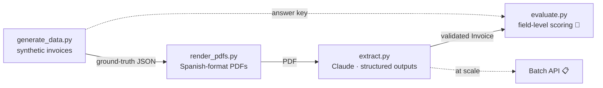

# 🧾 Lab 01 · Invoice Data Extraction with Claude

**Turn Spanish PDF invoices into validated, ERP-ready JSON, with a measurable accuracy and a known cost per document.**


> [!NOTE]
> **Status:** blocks 1–3 complete (data model, synthetic dataset, extraction). Full-dataset evaluation and Batch API processing are in progress. Results below are labelled as preliminary where applicable.

---

## 🇪🇸 Resumen en español

Sistema que extrae datos estructurados de facturas españolas en PDF (emisor, cliente, líneas, base imponible, IVA, retención de IRPF y total) y los devuelve como JSON validado, listo para un ERP. Usa **salidas estructuradas** de Claude para garantizar el esquema, un **dataset sintético con ground truth exacto** para evaluar campo a campo y un **análisis de tokens y costes** por factura. En la primera prueba, una factura compleja (IVA mixto e IRPF) se extrajo con coincidencia exacta en todos los campos.

---

## 💼 The business problem

Supplier invoices are still keyed in by hand in many finance teams: slow, error-prone and expensive at scale. The hard part isn't reading text, it's turning a visually formatted document into **exact, typed data**:

- `4.357,20 €` must become `4357.2`
- `15/03/2026` must become `2026-03-15`
- **"Cliente"** on the page must map to `recipient` in the data model
- Addresses, tax IDs and names must be copied **verbatim**, never "corrected"

This lab builds that pipeline end to end and, crucially, **measures** how well it works.

## ✨ Highlights

| | |
|---|---|
| 🎯 **Schema-guaranteed output** | Structured outputs use constrained decoding: the model *cannot* return JSON that breaks the `Invoice` schema. |
| 🧪 **Exact ground truth, zero labelling** | PDFs are generated *from* known data, so every invoice has a perfect answer key. |
| ✅ **Preliminary result** | A 4-line invoice with mixed VAT (21 % / 10 %) and IRPF withholding was extracted with an **exact match on every field**. |
| 📉 **Output tokens cut by 55 %** | 850 → 383 output tokens per invoice vs. free-text reading, by dropping reasoning and prose. |
| 🔁 **Fully reproducible** | Fixed random seed + `uv.lock`: anyone can regenerate the same dataset and environment with one command. |

## 🏗️ Architecture



## 🧠 Claude features used

| Feature | Where | Why | Status |
|---|---|---|---|
| **Messages API** | All scripts | Core request: `model`, `max_tokens`, `system`, `messages`. | ✅ |
| **PDF support** (`document` blocks, base64) | `read_pdf.py`, `extract.py` | Claude reads each page as text *and* image, so it understands tables and layout. | ✅ |
| **Structured outputs** (`messages.parse` + Pydantic) | `extract.py` | Guarantees schema-compliant JSON through constrained decoding. No parsing errors, no missing fields. | ✅ |
| **System prompt** | `extract.py` | Holds the extraction rules: verbatim copy, number/date conversion, `null` for absent optional fields. | ✅ |
| **Reasoning control** (`thinking: between_tools`) | `extract.py` | Turns off up-front reasoning: a well-laid-out invoice doesn't need it, so cost and latency drop. | ✅ |
| **Batch API** | `batch.py` | Process the full dataset asynchronously at a discount. | 📋 Planned |
| **Prompt caching** | — | System prompt + schema are identical on every call (~1,570 fixed input tokens). | 🔍 To explore |

## 🚀 Quickstart

**Requirements:** [uv](https://docs.astral.sh/uv/) (it manages Python 3.12 for you) and an Anthropic API key.

```bash
git clone https://github.com/apuerta-maker/claude-labs.git
cd claude-labs/lab01-invoice-extraction

# Create the environment with the exact versions from uv.lock
uv sync

# Add your API key to a .env file at the REPOSITORY ROOT
cp .env.example ../.env       # then edit ../.env and paste your key
chmod 600 ../.env             # readable only by you
```

Run the pipeline:

```bash
uv run python -m lab01_invoice_extraction.generate_data    # 10 ground-truth invoices (seed 42)
uv run python -m lab01_invoice_extraction.render_pdfs      # render them as PDFs
uv run python -m lab01_invoice_extraction.extract invoice_003   # extract one and compare
```

Expected output of the last command (abridged):

```text
{ "invoice_number": "2026-C-0003", "issue_date": "2026-01-12", ... "total": 5863.27 }

Exact match with ground truth? True
stop_reason: end_turn · Input tokens: 3588 · Output tokens: 383
```

## 📁 Project structure

```text
lab01-invoice-extraction/
├── .env.example                  # required variables, no real values
├── pyproject.toml / uv.lock      # declared deps + exact pinned versions
├── data/
│   ├── ground_truth/             # 10 answer-key invoices (JSON)
│   └── pdfs/                     # the same 10 invoices as PDFs
└── src/lab01_invoice_extraction/
    ├── schema.py                 # Pydantic data model (the contract)
    ├── generate_data.py          # synthetic dataset generator
    ├── render_pdfs.py            # JSON → Spanish-format PDF
    ├── read_pdf.py               # exploration: free-text reading
    ├── extract.py                # structured extraction with Claude
    └── evaluate.py               # field-level evaluation 🚧
```

## 🗂️ Data model

<details>
<summary><b>Click to expand the <code>Invoice</code> schema</b></summary>

```text
Invoice
├── invoice_number      str          "2026-A-0042"
├── issue_date          date         ISO 8601
├── issuer              Party        name · tax_id (NIF/CIF) · address
├── recipient           Party        name · tax_id (NIF/CIF) · address
├── line_items          [LineItem]   description · quantity · unit_price · vat_rate
├── tax_base            float        base imponible
├── vat_amount          float        cuota de IVA
├── irpf_amount         float | None retención de IRPF (only freelancers)
└── total               float        total a pagar
```

Every field carries a `description` that travels inside the JSON Schema sent to Claude, so **the schema doubles as the prompt**. Descriptions use the exact Spanish terms printed on invoices ("base imponible", "cuota de IVA") so the model can map labels to fields.

</details>

## 🧪 Synthetic dataset

| Property | Value |
|---|---|
| Invoices | 10, generated with Faker (`es_ES`) and a fixed seed |
| Lines per invoice | 1 to 5 |
| VAT rates | 21 %, 10 % and 4 %, mixable within one invoice |
| IRPF withholding (15 %) | 4 of 10 invoices (issued by freelancers to companies) |
| Arithmetic | Tax base, VAT, IRPF and total are *computed* from the lines, never invented |
| PDF formats | Spanish amounts (`4.357,20 €`) and dates (`15/03/2026`) |

**Built-in edge cases:** postal codes with a leading zero (`05508`), the label *"Cliente"* instead of *"Destinatario"*, and unusual values that must be copied as-is.

> [!IMPORTANT]
> **Known limitation:** Faker data is realistic in *format* but not internally consistent (postal codes don't match cities, CIF letters don't match legal forms). This is acceptable by design: extraction must reproduce **printed** values, not fix them.

## 🧭 Design decisions

1. **Schema first.** The data model was defined before any prompt. It is the contract with the business, the specification for Claude and the backbone of the evaluation.
2. **Data first, document second.** Generating PDFs *from* data gives an exact answer key with zero manual labelling, and full control over edge cases.
3. **Structured outputs over forced tool use.** The classic extraction pattern forces a tool call via `tool_choice`. The model used doesn't support forcing tools, so the pipeline moved to structured outputs, which offer a *stronger* guarantee: constrained decoding makes schema violations impossible.
4. **No up-front reasoning.** Start with the cheapest, fastest configuration; add reasoning only if the evaluation proves it improves accuracy. Capability must be justified by a metric, not a hunch.
5. **Handle response blocks by type, never by position.** A response is a list of blocks (`thinking`, `text`, `tool_use`…). Code that assumes `content[0]` is text works *most* of the time, which is exactly how it fails in production.
6. **Check `stop_reason` before trusting output.** Only `end_turn` is accepted; `max_tokens` or `refusal` can yield incomplete output.
7. **`float` for amounts, tolerance in evaluation.** Keeps the schema clean; amounts are compared within €0.01 and would be converted to `Decimal` at the ERP boundary in production.

## 📊 Evaluation

> [!NOTE]
> Full-dataset results are in progress. This section will be updated with field-level metrics.

**Methodology**

- Extract all 10 invoices and compare **field by field** against the ground truth.
- Amounts compared with a **€0.01 tolerance**; text compared after whitespace normalisation (case, accents and punctuation still count).
- The number of line items is scored as its own field; missing *and* extra fields count as errors.
- Extraction (paid API calls) is cached to disk and kept separate from scoring (free), so scoring rules can be iterated at zero cost.

**Preliminary result:** `invoice_003` (4 lines, mixed 21 %/10 % VAT, IRPF withholding) → **exact match on all fields**, including a verbatim address with its postal code.

## 💰 Cost analysis

Measured with `claude-sonnet-5-5` on a one-page invoice:

| Call | Input tokens | Output tokens |
|---|---:|---:|
| Plain text question (`hello_claude.py`) | 32 | 174 |
| PDF, free-text answer with reasoning (`read_pdf.py`) | 2,017 | 850 |
| **PDF, structured output (`extract.py`)** | **3,588** | **383** |

**Takeaways**

- One PDF page ≈ **2,000 input tokens**.
- Structured outputs add ≈ **1,570 fixed input tokens** per call (system prompt, schema and an auto-injected format prompt) but cut output by **55 %**.
- Output tokens are priced higher than input tokens, so the net effect is computed with official pricing:

```text
cost = (input_tokens × input_price + output_tokens × output_price) / 1,000,000
```

**Next:** cost per invoice in euros with current official prices, Batch API discount, and prompt caching on the fixed part of the input.

## 🎓 Lessons learned

- **Never index `response.content[0]` blindly.** The same code worked on a simple question and crashed on a PDF, because the model chose to emit a `thinking` block first on the harder task.
- **API parameters differ across models.** Two `400` errors (`thinking: disabled`, forced `tool_choice`) came from options the model doesn't support. Both error messages pointed to the fix; the official docs are the source of truth.
- **Free text is not extraction.** Reading the PDF in prose, the model added a comma to an address and dropped its postal code. With structured outputs and an explicit "copy verbatim" rule, the result was exact.
- **Validate your ground truth by hand.** A manual check of one invoice revealed a stray space in generated addresses that would have caused false failures in the evaluation.

## 🔐 Security

- API key lives in a `.env` at the repository root, excluded via `.gitignore` and restricted with `chmod 600`.
- `.env.example` documents required variables without real values.
- Commits use a GitHub `noreply` address; all data is synthetic.

## 🗺️ Roadmap

- [x] Data model with Pydantic
- [x] Reproducible synthetic dataset (JSON + PDF)
- [x] Structured extraction with Claude
- [ ] Field-level evaluation on the full dataset
- [ ] Batch processing with the Batch API
- [ ] Cost per invoice with official pricing
- [ ] Prompt caching experiment
- [ ] Harder dataset: scanned/rotated invoices, multi-page documents

## 🧩 Skills demonstrated

`Messages API` · `PDF document blocks` · `Structured outputs` · `JSON Schema design` · `Pydantic` · `Evaluation with ground truth` · `Token & cost analysis` · `Reproducible Python environments (uv)` · `Secrets management`

